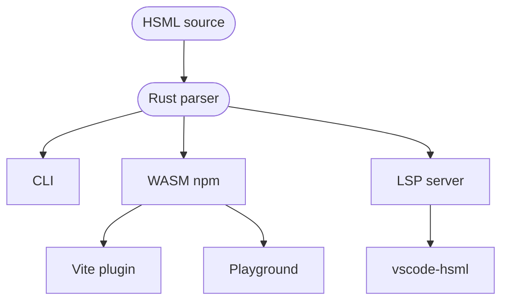

# HSML

## Hyper Short Markup Language

A pug-inspired HTML preprocessor, written in Rust.

<div class="pt-12 opacity-70">
  Christopher Quadflieg &middot; Vue.js Hamburg <span op="60">#</span>21 &middot; 2026-07-01
</div>

<div class="abs-br m-6 text-xl flex gap-3">
  <a href="https://github.com/hsml-lab" target="_blank" class="slidev-icon-btn" title="hsml-lab on GitHub">
    <carbon:logo-github />
  </a>
  <a href="https://hsml-lab.github.io/playground/" target="_blank" class="slidev-icon-btn" title="HSML Playground">
    <carbon:code />
  </a>
</div>

<!--
Welcome! 20 minutes, then 5 for questions.
Today: why HSML exists, what it is, how it works, and how to drop it into your Vue project tonight.
-->

---
transition: fade-out
layout: center
class: text-center
---

# Hi, I'm Christopher

Open-source maintainer · `@Shinigami92`

I write Vue and Rust - and, as a frontend dev, a lot of HTML.

<div v-click class="pt-10 text-2xl opacity-80">
  I got tired of writing HTML.
</div>

<div v-click class="pt-2 text-lg opacity-60">
  So I built a way to write less of it.
</div>

---
transition: slide-up
---

# How I got here

<div class="pt-8 space-y-6 text-lg">

<div v-click>
  <span class="opacity-50 inline-block w-32">2019–2021</span>
  <strong>adSoul GmbH</strong> &nbsp;·&nbsp;
  <span class="opacity-80">first contact with Pug - I loved it.</span>
</div>

<div v-click>
  <span class="opacity-50 inline-block w-32">while there</span>
  wrote <a href="https://github.com/prettier/plugin-pug" target="_blank"><code>@prettier/plugin-pug</code></a> &nbsp;·&nbsp;
  <span class="opacity-80">a Pug formatter for Prettier.</span>
</div>

<div v-click>
  <span class="opacity-50 inline-block w-32">then</span>
  <strong>Tailwind happened</strong> &nbsp;·&nbsp;
  <span class="opacity-80">and Pug couldn't keep up.</span>
</div>

</div>

<div v-click class="pt-12 text-center text-xl opacity-80">
  I didn't bail on Pug lightly.
</div>

<!--
Markus Heiden (lead dev at adSoul) is in the audience - wave to him during the first bullet.
The plugin-pug detail matters: it signals I shipped real Pug tooling before deciding it
wasn't enough. The frustration that birthed HSML is concrete, not theoretical.
-->

---
layout: center
---

# Let's start with some Vue

```vue {all|2-5|6-10}
<template>
  <div class="container mx-auto px-4 py-8">
    <h1 class="text-3xl font-bold text-gray-900">
      Hello World
    </h1>
    <div class="card rounded-lg shadow-md bg-white p-6">
      
      <p class="text-gray-500 mt-2">Nice to meet you!</p>
    </div>
  </div>
</template>
```

<div v-click class="pt-4 text-center text-xl opacity-80">
  Familiar? <span v-mark.red="3">Also: a lot of noise.</span>
</div>

<!--
Click 1 - point at the wrapping `<div>` repetition.
Click 2 - point at the explicit closing tags and attribute formatting.
Click 3 - the punchline.
-->

---

# We've seen this problem before

<div class="grid grid-cols-2 gap-8 pt-4">

<div>

### Pug solved it in 2010

```pug
.container.mx-auto.px-4.py-8
  h1.text-3xl.font-bold.text-gray-900 Hello World
  .card.rounded-lg.shadow-md.bg-white.p-6
    img.rounded-full(src="/avatar.jpg")
    p.text-gray-500.mt-2 Nice to meet you!
```

Indentation instead of closing tags. Class shorthand. Lean.

</div>

<div v-click>

### Then Tailwind happened

```pug
.bg-\[\#1da1f2\].text-white
  .lg\:hover\:underline
    .\[\&\:nth-child\(3\)\] 😱
```

Pug treats `[`, `(`, `:`, `&` as syntax.
Arbitrary values need escaping. Everywhere.

</div>

</div>

<div v-click class="pt-6 max-w-3xl mx-auto border-l-2 border-orange-400 pl-4 text-sm opacity-80">
  <em>&ldquo;We intentionally do not support this, as we want to save those special characters for potential future use.&rdquo;</em>
  <div class="opacity-60 pt-1">
    - ForbesLindesay, Pug maintainer
    (<a href="https://github.com/pugjs/pug/issues/3155" target="_blank">pugjs/pug#3155</a>, 2019)
  </div>
</div>

<div v-click class="pt-6 text-center text-xl">
  We need <span v-mark.circle.orange="3">Pug's ergonomics</span> with <span v-mark.circle.orange="3">Tailwind's freedom</span>.
</div>

<!--
Pug is great. But it predates the utility-CSS era.
Once Tailwind arbitrary values landed, Pug became hostile - and the maintainers explicitly
declined to add support. PRs and issues (#3155, #3307, #3373) span 2019–2022.
If anyone wants more receipts, point them at the memory note.
-->

---
transition: slide-up
---

# Hello, HSML

````md magic-move {lines: true}
```hsml
doctype html
html
  head
    title My Page
  body
    h1.text-xl.font-bold Hello World
    .card
      img.rounded-full(src="/avatar.jpg" alt="Me")
      p.text-gray-500 Nice to meet you!
```

```html
<!DOCTYPE html>
<html>
  <head>
    <title>My Page</title>
  </head>
  <body>
    <h1 class="text-xl font-bold">Hello World</h1>
    <div class="card">
      
      <p class="text-gray-500">Nice to meet you!</p>
    </div>
  </body>
</html>
```
````

<div class="text-center pt-4 opacity-70">
  Press space - same markup, compiled.
</div>

---

# Syntax tour - tags, classes, ids

<div class="grid grid-cols-2 gap-6 pt-2">

<div>

**Tags nest by indentation**

```hsml
div
  p Some text
  ul
    li First
    li Second
```

**`div` is the default tag**

```hsml
.container
  .card
    .card-body Hello
```

</div>

<div>

**Classes and IDs inline**

```hsml
h1#title.text-red.font-bold Hello
```

**Text blocks for multi-line content**

```hsml
p.
  This is a multi-line
  text block that
  preserves line breaks.
```

</div>

</div>

---

# Syntax tour - attributes

<div class="grid grid-cols-2 gap-6 pt-2">

<div>

**Inline**

```hsml
img(src="/photo.jpg" alt="A photo")
a(href="/" target="_blank") Home
button(disabled) Click
```

</div>

<div>

**Multiline when it gets long**

```hsml
img(
  src="/photo.jpg"
  alt="A photo"
  width="300"
  height="200"
)
```

</div>

</div>

<div v-click class="pt-6">

**Comments** - and they work *inside* attribute lists too

```hsml
// Dev comment - stripped from output
//! Native comment - rendered as <!-- ... -->

img(
  // even between attrs
  src="/photo.jpg"
  alt=""           // empty on purpose 🤷
)
```

</div>

<!--
Attribute-inline comments are a small thing, but Pug breaks on them. They matter when you're
documenting why a particular ARIA attribute, alt="", or data-* is the way it is - context that
belongs next to the attr, not at the top of the file.
-->

---
layout: center
---

# The killer feature

Tailwind arbitrary values, **unescaped**:

```hsml {all|1|2|3}
.bg-[#1da1f2].text-white
.lg:[&:nth-child(3)]:hover:underline
.grid-cols-[repeat(auto-fit,minmax(200px,1fr))]
```

<div v-click class="pt-8 text-center text-xl opacity-80">
  No backslashes. No template literals. Just write it.
</div>

<!--
This is the moment Pug users go "ohhh".
HSML's parser was designed Tailwind-first.
-->

---

# Vue and Angular directives just work

<div class="grid grid-cols-2 gap-6 pt-2">

<div>

**Vue**

```hsml
button(
  @click="handleClick"
  :class="dynamicClass"
  v-if="show"
) Click

template(#default)
  p Slot content

ul
  li(v-for="item in items" :key="item.id")
    span {{ item.name }}
```

</div>

<div>

**Angular**

```hsml
button(
  [disabled]="isDisabled"
  (click)="onClick()"
) Click

div(*ngIf="show")
  p Hello
```

</div>

</div>

<div v-click class="pt-6 text-center opacity-80">
  Framework attribute syntax is parsed natively - no escapes, no plugins.
</div>

---

# Helpful diagnostics

Like a compiler should:

```log
error[E001]: Tag name must start with an ASCII letter
 --> example.hsml:1:1
  |
1 | 42div Hello
  | ^
```

<div v-click class="pt-6">

```log
warning[W002]: Duplicate class 'foo'
 --> example.hsml:1:12
  |
1 | h1.foo.foo Hello
  |        ^
```

</div>

<div v-click class="pt-6 text-sm opacity-70">
  6 error codes (E001–E006), 6 warning codes (W001–W006).
  Output as human, JSON, GitHub Actions annotations, or GitLab Code Quality.
</div>

---
layout: two-cols
layoutClass: gap-12 pt-8
---

# How it's built

<v-clicks>

- **Rust core** - parser, formatter, diagnostics
- **Native CLI** - `compile`, `check`, `fmt`, `parse`
- **WASM package** on npm - works in browsers and bundlers
- **Language Server** - diagnostics, hover, format in any LSP-aware editor
- **VS Code extension** - auto-downloads the binary

</v-clicks>

<div v-click class="pt-6 text-sm opacity-70">
  Fast enough to be invisible in watch mode and CI - no JS lexer in the hot path.
</div>

::right::

<div class="pt-2">



</div>

<!--
One parser, many surfaces.
The Vite plugin and the Playground both consume the WASM package.
-->

---
transition: slide-up
---

# Using HSML in Vue - setup

<div class="pt-2">

```sh
pnpm add -D vite-plugin-vue-hsml
```

</div>

<div v-click class="pt-6">

```ts {4,7}
// vite.config.ts
import { defineConfig } from "vite";
import vue from "@vitejs/plugin-vue";
import vueHsml from "vite-plugin-vue-hsml";

export default defineConfig({
  plugins: [vueHsml(), vue()],
});
```

</div>

<div v-click="2" class="pt-8 text-center text-xl">
  That's it. <span v-mark.underline.orange="2">Compile-time</span>. Zero runtime cost.
</div>

---

# `<template lang="hsml">`

```vue {all|1-5|7-13}
<script setup lang="ts">
import { ref } from "vue";

const count = ref(0);
</script>

<template lang="hsml">
div
  h1.text-xl.font-bold Hello World
  button(@click="count++") Count is {{ count }}
  .card
    p.text-gray-500 Nice to meet you!
</template>
```

<div v-click class="pt-4 text-center opacity-80">
  Vue's SFC compiler sees plain HTML. The plugin transforms it before Vue ever looks.
</div>

---
transition: slide-left
---

# Real-world: Elk's `MainContent.vue`

````md magic-move {lines: true}
```vue
<template>
  <div ref="container" :class="containerClass">
    <div
      sticky
      top-0
      z-20
      bg="[rgba(var(--rgb-bg-base),0.7)]"
      :class="{
        'backdrop-blur': !getPreferences(userSettings, 'lowPerformance'),
      }"
    >
      <div flex="~ justify-between" min-h-53px px-2 py-1 border="b base">
        <button
          v-if="showBackButton"
          btn-text
          flex
          items-center
          p-3
          xl:hidden
          :aria-label="$t('nav.back')"
          @click="$router.go(-1)"
        >
          <div text-lg i-ri:arrow-left-line class="rtl-flip" />
        </button>
        <slot name="title" />
      </div>
    </div>
  </div>
</template>
```

```vue
<template lang="hsml">
div(ref="container" :class="containerClass")
  .sticky.top-0.z-20(
    bg="[rgba(var(--rgb-bg-base),0.7)]"
    :class="{
      'backdrop-blur': !getPreferences(userSettings, 'lowPerformance'),
    }"
  )
    .min-h-53px.px-2.py-1(flex="~ justify-between" border="b base")
      button.btn-text.flex.items-center.p-3.xl:hidden(
        v-if="showBackButton"
        :aria-label="$t('nav.back')"
        @click="$router.go(-1)"
      )
        .text-lg.rtl-flip(i-ri:arrow-left-line)
      slot(name="title")
</template>
```
````

<div class="text-center pt-2 opacity-70 text-sm">
  Same component. Press space.
</div>

---
layout: center
class: text-center
---

# The numbers

<div class="grid grid-cols-2 gap-12 pt-8 text-5xl font-bold">

<div>

<div class="text-orange-400">−20%</div>
<div class="text-lg opacity-70 pt-2">characters</div>

</div>

<div>

<div class="text-orange-400">−47%</div>
<div class="text-lg opacity-70 pt-2">lines in the template</div>

</div>

</div>

<div v-click class="pt-12 text-xl opacity-80">
  Less to type. Less to read. Less to review.
</div>

<div v-click class="pt-4 text-base opacity-60">
  And fewer tokens for your AI to read and write.
</div>

<!--
The AI angle is small but lands with this audience - Copilot/Cursor/Claude users feel
the per-token cost. HSML's smaller surface means cheaper codegen and cheaper review.
-->

---
layout: center
class: text-center
---

# Let's try it live

<div class="text-3xl pt-6">
  <a href="https://hsml-lab.github.io/playground/" target="_blank">
    hsml-lab.github.io/playground
  </a>
</div>

<div class="pt-12 opacity-70 text-lg">
  WASM compilation, shareable URLs, full diagnostics.
</div>

<!--
SWITCH WINDOW. Demo plan:
1. Paste a small Vue-flavored HSML snippet.
2. Add a Tailwind arbitrary value live.
3. Introduce a deliberate error (`h1.foo.foo`) - show the warning.
4. Show the format button.
5. Share the URL hash back.
Budget: 3 minutes max. If running long, skip steps 3–4.
-->

---

# The hsml-lab ecosystem

<div class="grid grid-cols-2 gap-6 pt-2">

<div>

### Core

**[`hsml`](https://github.com/hsml-lab/hsml)**
Rust compiler, CLI, WASM, LSP

### Vue

**[`vite-plugin-vue-hsml`](https://github.com/hsml-lab/vite-plugin-vue-hsml)**
`<template lang="hsml">` in SFCs

</div>

<div>

### Editor

**[`vscode-hsml`](https://github.com/hsml-lab/vscode-hsml)**
Highlighting + LSP, auto-installs the binary

### Try without installing

**[`playground`](https://hsml-lab.github.io/playground/)**
Live WASM compile in the browser

</div>

</div>

<div v-click class="pt-10 text-center opacity-80">
  All MIT. Contributions and feedback very welcome.
</div>

---

# Roadmap

<div class="grid grid-cols-2 gap-8 pt-2">

<div>

### Shipped

- Parser with Tailwind support
- HTML compiler
- CLI: `compile`, `check`, `fmt`, `parse`
- WASM npm package
- Diagnostics (errors + warnings)
- `.hsmlignore` support
- LSP server
- GitHub / GitLab CI formatters

</div>

<div>

### Next

- Formatters - Prettier plugin, oxfmt
- Tailwind extractor - shorthand classes
  aren't picked up yet (source-map issue?)
- Angular control flow - `@if`, `@for`, `@switch`
- More framework integrations
  (Nuxt module, Astro, SvelteKit?)
- Source maps
- Richer LSP (completions, code actions)
- Maybe: `.hsml.erb` for Rails
- _Your feature here_ - open an issue

</div>

</div>

---
layout: center
class: text-center
---

# Thank you

<div class="pt-6 text-xl opacity-80">
  Try it &middot; break it &middot; tell me what hurts.
</div>

<div class="pt-12 text-lg space-y-2">
  <div class="flex justify-center items-center gap-1">
    <carbon:logo-github />
    <a href="https://github.com/hsml-lab" target="_blank">github.com/hsml-lab</a>
  </div>
  <div class="flex justify-center items-center gap-1">
    <carbon:code />
    <a href="https://hsml-lab.github.io/playground/" target="_blank">hsml-lab.github.io/playground</a>
  </div>
  <div class="flex justify-center items-center gap-1">
    <carbon:logo-mastodon />
    <a href="https://elk.zone/mas.to/@Shini92" target="_blank">@Shini92@mas.to</a>
  </div>
</div>

<div class="pt-12 text-2xl">
  Questions?
</div>

<PoweredBySlidev mt-10 />
